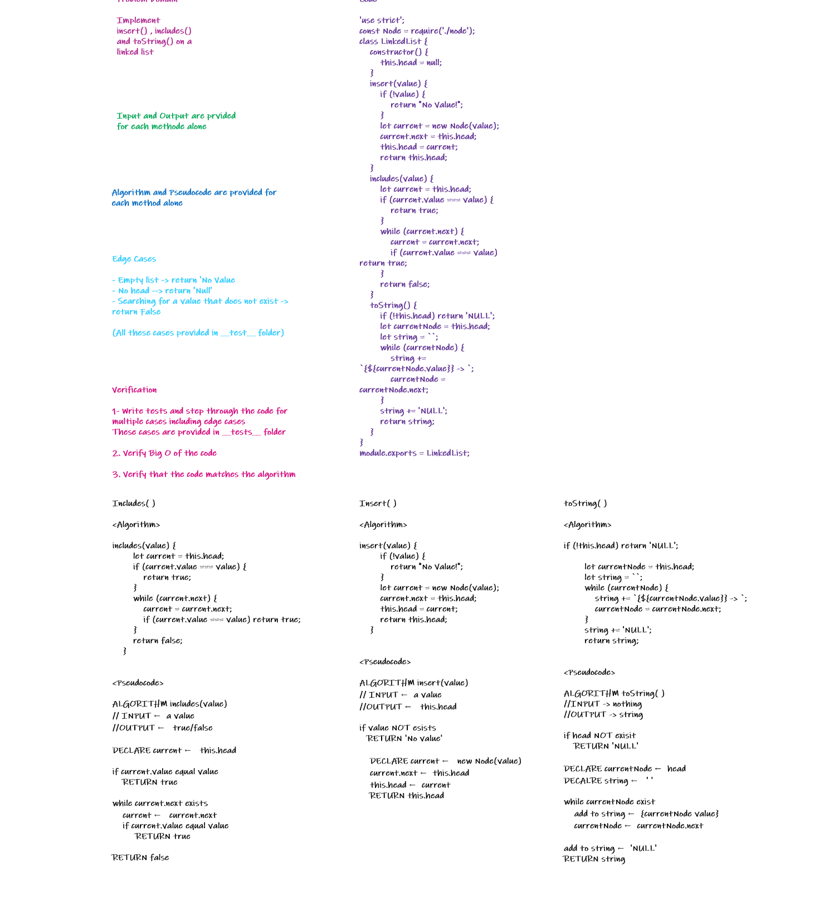
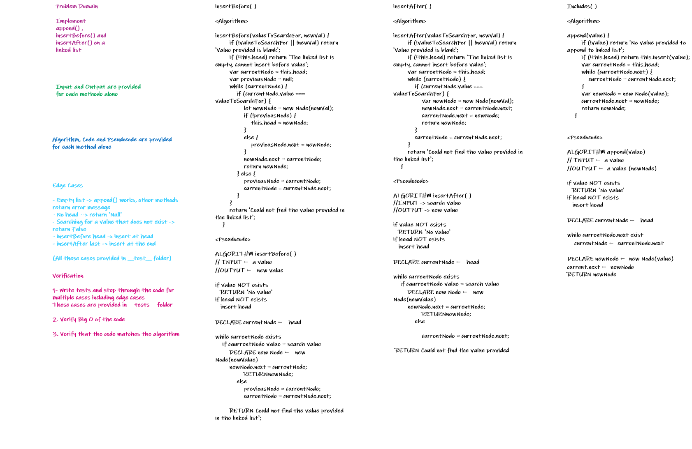
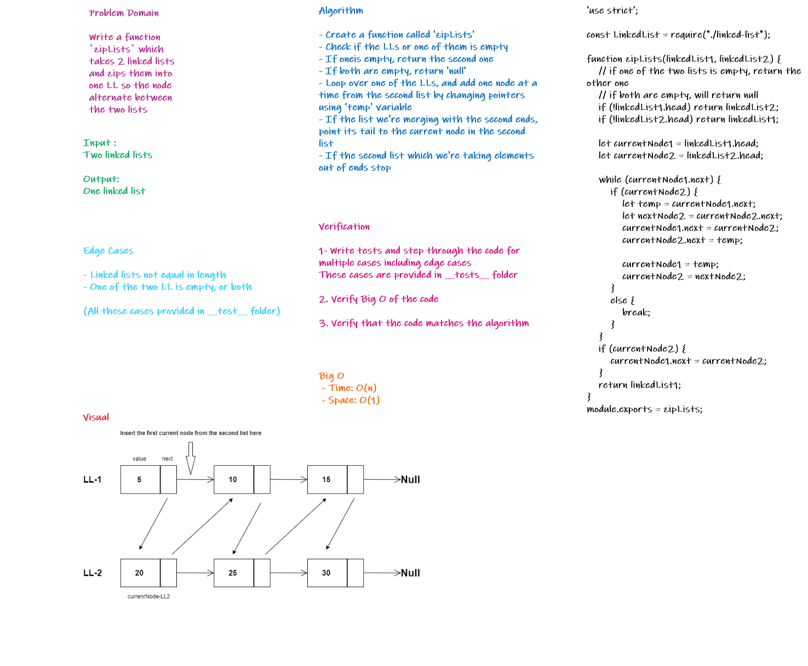

# Singly Linked Lists

Defining these methods `insert()` `includes()` `toString()` `append(value)` `insertBefore(value, newVal)` `insertAfter(value, newVal)` `kth-from-end` and `zip linked list` on linked list. It was done using JavaScript.

# Challenge

- Create a Node class that has properties for the value stored in the Node, and a pointer to the next Node.
- Within your LinkedList class, include a head property. Upon instantiation, an empty Linked List should be created.
   - Define a method called `insert` which takes any value as an argument and adds a new node with that value to the head of the list with an O(1) Time performance.
   - Define a method called `includes` which takes any value as an argument and returns a boolean result depending on whether that value exists as a Node’s value somewhere within the list.
   - Define a method called `toString` (or `__str__` in Python) which takes in no arguments and returns a string representing all the values in the Linked List, formatted as:
      - "{ a } -> { b } -> { c } -> NULL"
   - `.append(value)` which adds a new node with the given `value` to the end of the list.
   - `.insertBefore(value, newVal)` which add a new node with the given `newValue` immediately before the first `value` node
   - `.insertAfter(value, newVal)` which add a new node with the given `newValue` immediately after the first `value` node

- Write a function called `zipLists` which takes two linked lists as arguments. Zip the two linked lists together into one so that the nodes alternate between the two lists and return a reference to the head of the zipped list. Try and keep additional space down to O(1). You have access to the Node class and all the properties on the Linked List class as well as the methods created in previous challenges.   

# Approach & Efficiency

**insert**:

- Time – O(1)
- Space – O(1)

**includes**:

- Time - O(n)
- Space - O(1)

**toString**:

- Time - O(n)
- Space - O(n)

**append**:

- Time - O(n)
- Space - O(1)

**insertBefore**:

- Time - O(n)
- Space - O(1)

**insertAfter**:

- Time - O(n)
- Space - O(1)

**kthFromEnd**

- Time - O(n)
- Space - O(1)

**zipLists**:

- Time - O(n)
- Space - O(1)

# Solution

### insert(), include(), toString()

### insertBefore(), insertAfter(), append()

### kth-form-end

### Zip LL

