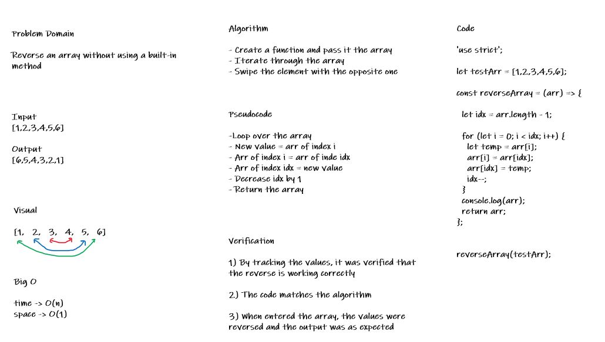

# Reverse an Array
This challenge is about reversing an array without using a built-in method.
It was done using JavaScript.

## Challenge
Write a function called reverseArray which takes an array as an argument. Without utilizing any of the built-in methods available to your language, return an array with elements in reversed order.

## Approach & Efficiency
I created a new array and a temporary variable to store the current element and then swipe it with the opposit element depending on the indexes of both then I looped over the array in reverse using idx-- and pushed the idx (index of the last value) to the new array and then returned the array.

Time complexity: O(n).
Space complexity: O(1).

## Solution

