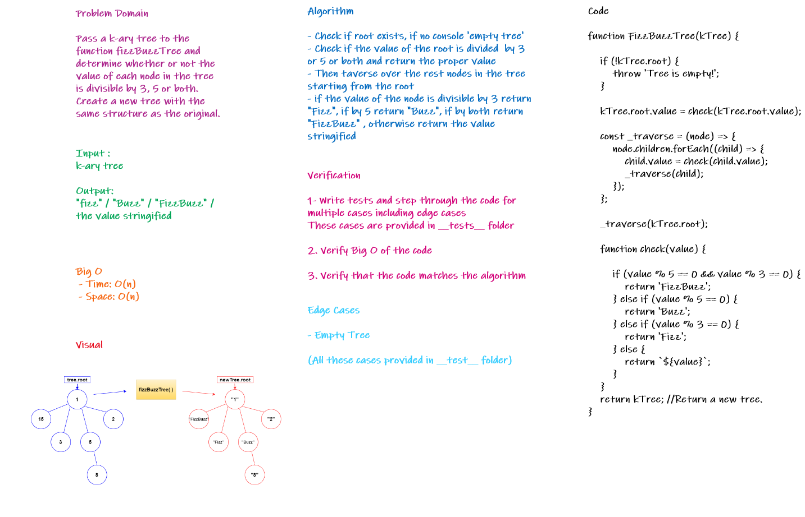

# FizzBuzz Tree

## Overview

Conduct “FizzBuzz” on a k-ary tree while traversing through it to create a new tree.

Set the values of each of the new nodes depending on the corresponding node value in the source tree.

## Challenge

- Write a function called `FizzBuzzTree` which takes a k-ary tree as an argument.
- Without utilizing any of the built-in methods available to your language, determine whether or not the value of each node is divisible by 3, 5 or both. Create a new tree with the same structure as the original, but the values modified as follows:
   - If the value is divisible by 3, replace the value with “Fizz”
   - If the value is divisible by 5, replace the value with “Buzz”
   - If the value is divisible by 3 and 5, replace the value with “FizzBuzz”
   - If the value is not divisible by 3 or 5, simply turn the number into a String.
- Return a new tree.

## Approach and Efficiency

- Time: O(n)
- Space: O(n)

## Solution

### fizzBuzz Tree

