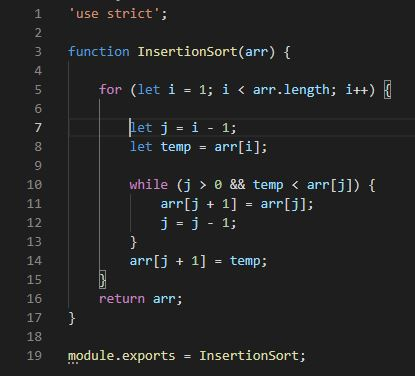

# Insertion Sort

Insertion sort is an algorithm that travesrses an array multiple times and reorders it in place so that the values are ordered from lowest to hightest. During each step in the process the current index value is compared to its following values. If a following value is lower it will swap places, if not it will remain in its current index position as the small values will be placed in the fron of the array.

## Pseudocode

## Trace

Sample Array: `[45,15,30]`

**Pass 1:**

`[45,15,30]`

During the first pass, index position 1 is assigned to the temp variable (15). Since j is equal to 0 and the temp (15) is < array[0] wwhich is (45) the while loop is entered. The array position 1 is then assigned the value of the current array position 0 (45). j is then decremented. After exiting the while loop the array position 0 is assigned the temp value (45).

At the end of the first pass the array is [15,45,30].

**Pass 2:**

`[15,45,30]`

During the second pass, index position 2 is assigned to the temp variable (30). Since j is equal to 1 and the temp (30) is < array[1] (45) the while loop is entered. The array position 2 is then assigned the value of the current array position 1 (45). j is then decremented. After exiting the while loop the array position 1 is assigned the temp value (30).

At the end of the second pass the array is [15,30,45].

**Pass 3:**

`[15,30,45]`

On the third pass, i = 3 which is not less than the array.length. So, the for loop is not entered and the algorithm proceeds to return array.

The sorted array is returned: [15,30,45].

## Efficency

- Time: O(n^2) 
   - the for loop will execute the while loop completely for each iteration (of the for loop).So, the time required will be the length of the array times the length of the array (n*n) = n^2

- Space: O(1) 
   - No additional space is being created. This array is being sorted in place…keeping the space at constant O(1).

## Code

