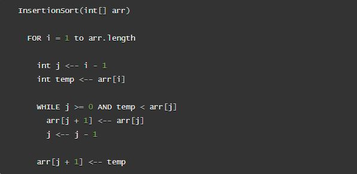
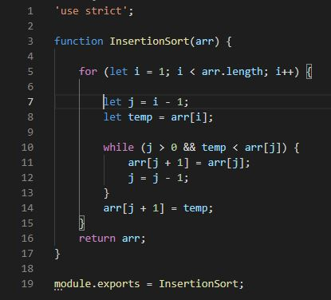

# Challenge Summary

### Author: Fatima Atieh

Create a function that sorts and array in place from lowest to hightest value.

## Challenge Description

Review the pseudocode below, then trace the algorithm by stepping through the process with the provided sample array. Document your explanation by creating a blog article that shows the step-by-step output after each iteration through some sort of visual.

Once you are done with your article, code a working, tested implementation of Insertion Sort based on the pseudocode provided.

## Approach & Efficiency

### Approach

As the algorithm loops through the array the lowest value is temporarily stored for each iteration and placed in the index position corresponding to its value order.

### Big(O)

- Time = O(n^2) 
- Space = O(1)

## Solution

