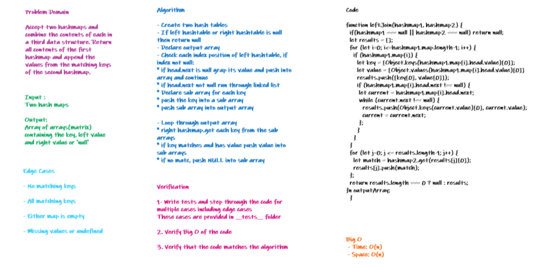

# Left Join

Accept two hashmaps and combine the contents of each in a third data structure. Return all contents of the first hashmap and append the values from the matching keys of the second hashmap.

## Challenge

- Write a function that `LEFT JOINs` two hashmaps into a single data structure.
- The first parameter is a hashmap that has word strings as keys, and a synonym of the key as values.
- The second parameter is a hashmap that has word strings as keys, and antonyms of the key as values.
- Combine the key and corresponding values (if they exist) into a new data structure according to LEFT JOIN logic.
- LEFT JOIN means all the values in the first hashmap are returned, and if values exist in the “right” hashmap, they are appended to the result row. If no values exist in the right hashmap, then some flavor of `NULL` should be appended to the result row.
- The returned data structure that holds the results is up to you. It doesn’t need to exactly match the output below, so long as it achieves the LEFT JOIN logic.
- Avoid utilizing any of the library methods available to your language.

## Approach and Efficiency 

This function stores all key value pairs from the left hashmap in an array then loops through the array and compare each key to the right hash map.

- Time : O(n)
- Space : O(n)

## API

