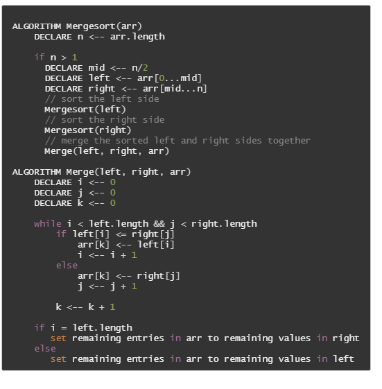
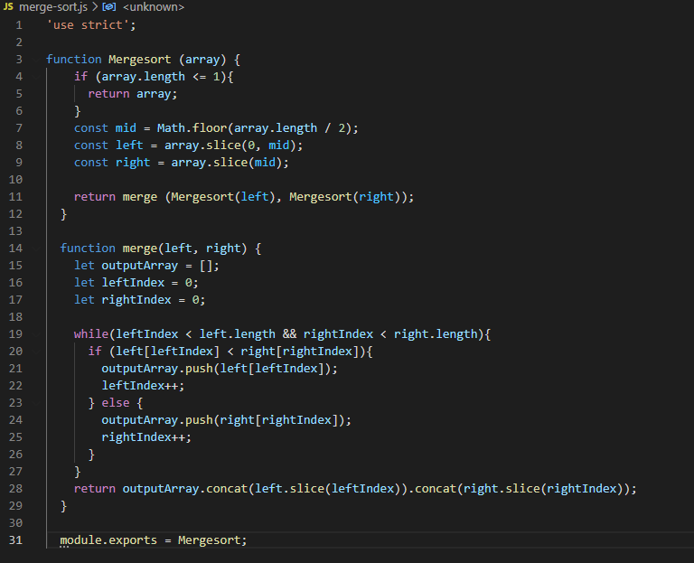

# Merge Sort

### Author: Fatima Atieh

## Challenge Summary

Create a function that sorts and merges an array in place from lowest to hightest value.

## Challenge Description

Review the pseudocode below, then trace the algorithm by stepping through the process with the provided sample array. Document your explanation by creating a blog article that shows the step-by-step output after each iteration through some sort of visual.

Once you are done with your article, code a working, tested implementation of Merge Sort based on the pseudocode provided.

## Approach & Efficiency

### Approach

This algorithm splits the original array in to equal or near equal parts and repeats this splitting until only two values are left in each sub-array. At this point the two values are compared and ordered. The two nearest sub-arrays are then merged so that their values are all in order. This is repeated until the entire array has been rebuilt in order.

### Big(O)

- Time = O(nlogn)
- Space = O(n)

## Solution

