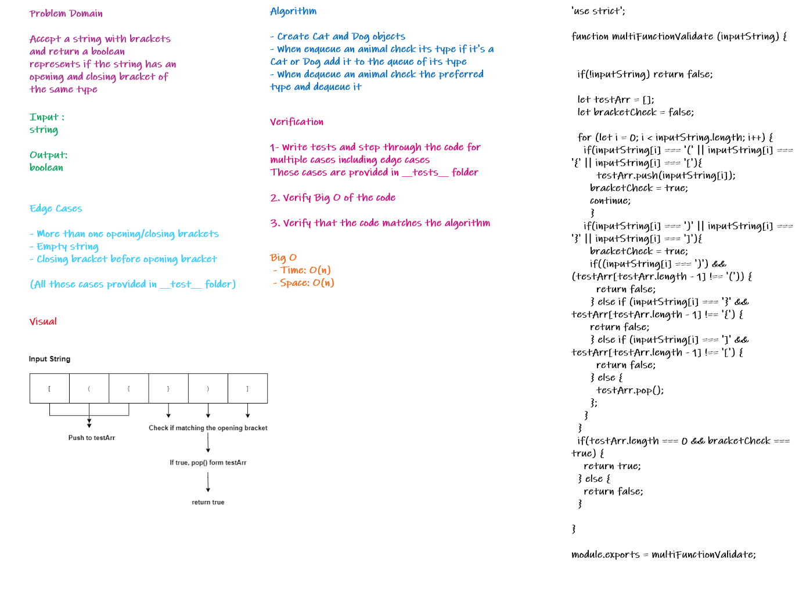

# Multi-bracket Validation.

# Challenge

Create a function that takes a string as its only argument, and should return a boolean representing whether or not the brackets in the string are balanced. There are 3 types of brackets:

   - Round Brackets : `()`
   - Square Brackets : `[]`
   - Curly Brackets : `{}`

# Approach and Efficiency

- Time: O(n)
- Space: O(n)

# Solution

